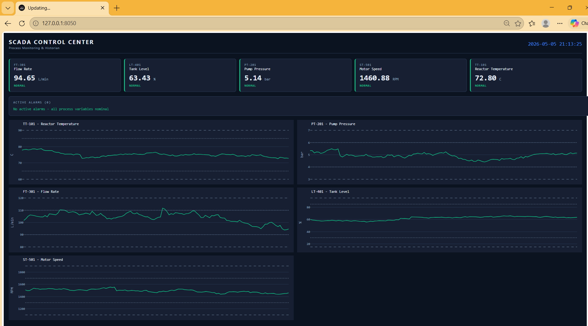

# SCADA Control Center

A live web-based **Supervisory Control and Data Acquisition (SCADA)** dashboard built in Python. It simulates a small industrial process, polls five sensors on a one-second scan cycle, stores every reading in a time-series historian, and visualises the live state of the plant in a browser-based HMI.

This project demonstrates the core building blocks of a real SCADA system on a small scale: the **field layer** (sensors), the **historian** (data persistence), and the **HMI** (operator interface), all communicating through a clean, decoupled architecture.

---

## Dashboard Preview



---

## Features

- **Live process monitoring** — current values for every tag, refreshed every second.
- **Industrial alarm system** — each tag is classified as `NORMAL`, `WARNING`, or `CRITICAL` based on configurable hi/lo limits, with colour-coded indicators on the dashboard.
- **Active alarms panel** — only deviating tags are shown, the way real SCADA systems summarise plant health.
- **Time-series trends** — the last two minutes of data plotted for every tag, with reference lines for warning and critical limits.
- **Historian database** — every reading is logged to a SQLite database (`historian.db`) so historical data persists across restarts.
- **Realistic sensor simulation** — each tag uses a mean-reverting random walk plus occasional process upset events, so values move the way real instruments do.
- **Dark industrial HMI theme** — visual style modelled on real SCADA control room interfaces.

---

## Architecture

```
   +----------------------+       +----------------------+
   |   Sensor Simulator   |  -->  |  Background Poller   |
   |   (5 process tags)   |       |       (1 Hz)         |
   +----------------------+       +----------+-----------+
                                             |
                                             v
                                  +----------------------+
                                  |   Historian (SQLite) |
                                  +----------+-----------+
                                             |
                                             v
                                  +----------------------+
                                  |    Dash + Plotly     |
                                  |   (HMI / Browser)    |
                                  +----------------------+
```

The poller runs in a background thread and writes to the historian on every scan cycle. The Dash app runs independently and reads from the historian when it refreshes the UI. This separation mirrors how real SCADA systems decouple acquisition from presentation.

---

## Process Variables (Tags)

| Tag    | Description           | Unit  | Setpoint | Warning Range | Critical Range |
|--------|-----------------------|-------|----------|---------------|----------------|
| TT-101 | Reactor Temperature   | C     | 75       | 65 - 85       | 60 - 90        |
| PT-201 | Pump Pressure         | bar   | 5.0      | 4.0 - 6.0     | 3.0 - 7.0      |
| FT-301 | Flow Rate             | L/min | 100      | 90 - 110      | 80 - 120       |
| LT-401 | Tank Level            | %     | 60       | 30 - 85       | 15 - 95        |
| ST-501 | Motor Speed           | RPM   | 1500     | 1300 - 1700   | 1100 - 1900    |

The tag naming follows ISA-style conventions (`TT` = Temperature Transmitter, `PT` = Pressure Transmitter, `FT` = Flow Transmitter, `LT` = Level Transmitter, `ST` = Speed Transmitter).

---

## Tech Stack

- **Python 3** — application language
- **Dash** — web framework for the HMI
- **Plotly** — interactive trend charts
- **SQLite** — embedded historian database
- **threading** — background scan cycle

---

## How to Run

### Prerequisites
- Python 3.9 or newer
- `pip` package manager

### Setup

```bash
git clone https://github.com/SaraEwaida/scada-dashboard.git
cd scada-dashboard
pip install -r requirements.txt
```

### Run

```bash
python app.py
```

Open a browser and navigate to:

```
http://127.0.0.1:8050
```

The dashboard will appear with live data updating every second.

To stop the application, press `Ctrl + C` in the terminal.

---

## Project Structure

```
scada-dashboard/
├── app.py                 # Dash application and HMI layout
├── sensor_simulator.py    # Process variable simulator with realistic noise
├── database.py            # SQLite historian (init, log, query)
├── requirements.txt       # Python dependencies
├── historian.db           # Generated at runtime - holds logged readings
├── screenshoots/          # Dashboard screenshots used in this README
└── README.md
```

---

## Possible Extensions

The current project is a foundation that can grow toward a more complete SCADA system:

- **Modbus TCP ingestion** — replace the simulator with real Modbus polling using `pymodbus`, so the dashboard can monitor real PLCs or industrial devices.
- **Operator setpoint controls** — add UI controls so operators can change setpoints from the dashboard.
- **Alarm acknowledgment & event log** — track when alarms occurred, who acknowledged them, and when they cleared.
- **User authentication & roles** — separate operator and engineer privilege levels.
- **Trend export** — let operators export historical data as CSV for reporting.

---

## Author

**Sara Ewaida** — Computer Engineering, Birzeit University
GitHub: [@SaraEwaida](https://github.com/SaraEwaida)
